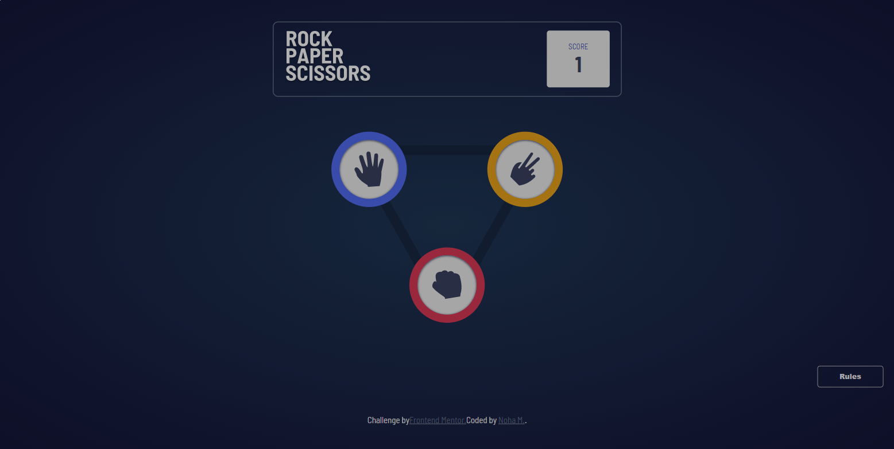

# Frontend Mentor - Rock, Paper, Scissors Game Solution

This is a solution to the [Rock, Paper, Scissors challenge on Frontend Mentor](https://www.frontendmentor.io/challenges/rock-paper-scissors-game-pTgwgvgH). Frontend Mentor challenges help you improve your coding skills by building realistic projects. 

## Table of contents

- [Overview](#overview)
  - [The challenge](#the-challenge)
  - [Screenshot](#screenshot)
  - [Links](#links)
  - [Built with](#built-with)
  - [How To Run / Install](#how-to-run)

## Overview

### The challenge

Users should be able to:

- [x] View the optimal layout for the game depending on their device's screen size
- [x] Play Rock, Paper, Scissors against the computer
- [ ] Maintain the state of the score after refreshing the browser _(optional)_
- [ ] **Bonus**: Play Rock, Paper, Scissors, Lizard, Spock against the computer _(optional)_

### Screenshot

### Links

- Solution URL: [GitHub Repo](https://github.com/NohaaAa/frontend-mentor-challenge-rock-paper-scissors-game)
- Live Site URL: [Frontend Mentor | Rock, Paper, Scissors Game](https://rock-paper-scissors-game-lovat.vercel.app/)

### Built with

- Semantic HTML5 markup
- CSS
- Flexbox
- [React](https://reactjs.org/) - JS library

### How To Run / Install

- `npm install` or `yarn install` to install all project dependencies
- `npm start` or `yarn start` to start development server
- server will be running on `localhost:3000` on your local  machine.